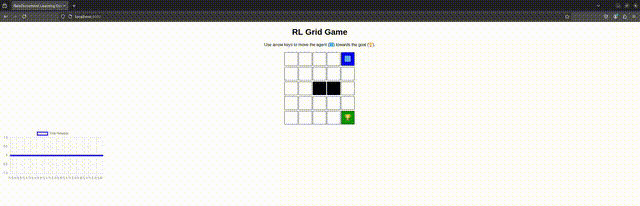

# 🎮 Reinforcement Learning Grid Game

A simple JavaScript-based RL environment where an agent learns to navigate a grid world using **Q-Learning**.

## 🚀 Features
✅ **5x5 Gridworld** environment  
✅ **Agent (🟦) learns to reach the goal (🏆) efficiently**  
✅ **Walls act as obstacles**  
✅ **Q-Learning Algorithm for decision-making**  
✅ **Live Learning Progress Visualization using Chart.js**  

---

## 📜 Game Rules
1. The agent **starts at a random position**.  
2. The **goal** is placed at a fixed position.  
3. The agent can **move in four directions**: **Up, Down, Left, Right**.  
4. The agent receives **rewards**:  
   - `+10` for reaching the **goal**.  
   - `-5` for hitting a **wall**.  
   - `-1` for each **step taken** (to encourage efficiency).  
5. The game **resets when the goal is reached**.  

---

## 🔧 Installation & Running the Game

### **Option 1: Using Python Local Server**
1. **Clone the repository**  
   ```bash
   git clone https://github.com/YOUR_GITHUB_USERNAME/RL-GridGame.git
   cd RL-GridGame
   ```
2. **Start a local server** using Python:  
   ```bash
   python3 -m http.server
   ```
3. Open `http://localhost:8000` in your browser.

### **Option 2: Open Directly in Browser**
1. Simply open `index.html` in any modern web browser.

---

## 📂 Project Structure
```
RL-GridGame/
│-- index.html  # Main HTML file
│-- game.js     # JavaScript file with game logic
│-- README.md   # Project documentation
```

---

## 🖥️ How It Works
- The **grid** is dynamically generated using JavaScript.
- The **Q-Learning** algorithm updates the agent’s movement strategy over time.
- **Chart.js** visualizes the learning progress.
- The agent learns from **rewards and penalties** to optimize its path to the goal.

---

## 📸 Demo


---

## 🛠️ Technologies Used
- **JavaScript** for game logic
- **HTML & CSS** for UI
- **Chart.js** for data visualization
- **Q-Learning Algorithm** for reinforcement learning

---

## 🤝 Contributing
Contributions are welcome! Feel free to fork this repository and submit pull requests.

---

## 📜 License
This project is open-source and available under the **MIT License**.

